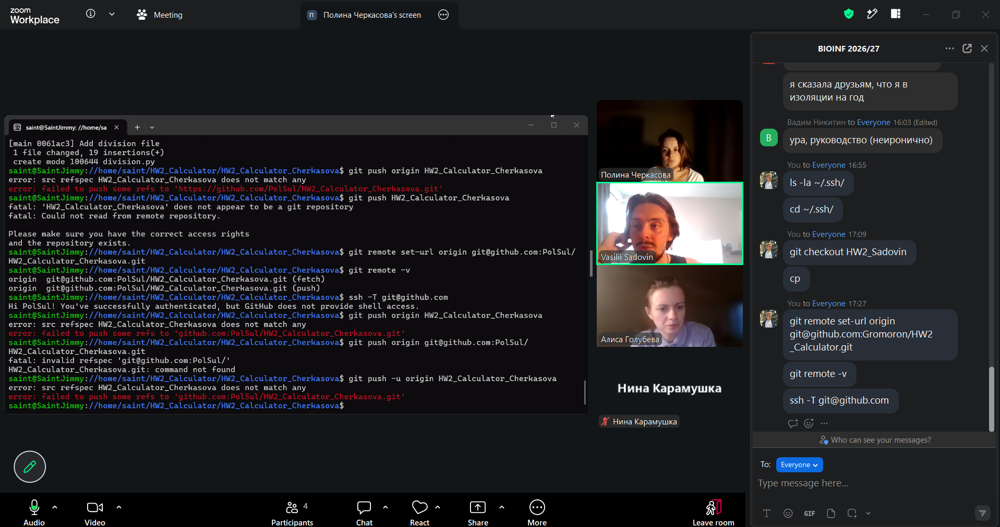

#Absolutely newbe, yet distinguished Python calculator#

Please, do not abuse its functioning it designed rather for paraolympiad in mathematucs, rather then expereinced bioinformaticians, so please, be kind with it.

Stick to basic operations, such as <mark>adding (+), substracting(-), multily(*) and division(/)</mark>.

Honourable authors of this forked repository are:

* ***Ekaterina Belyaeva***

* ***Nina Karamushka***

* ***Alisa Golubeva***

* ***Polina Cherkasova***

* ***Vasilii Sadovin*** 
